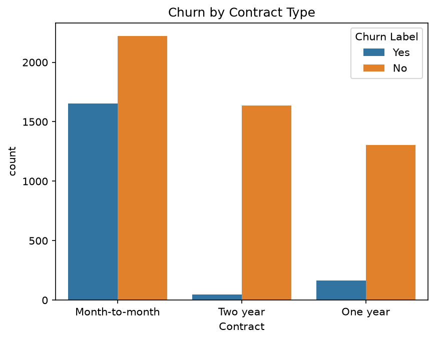
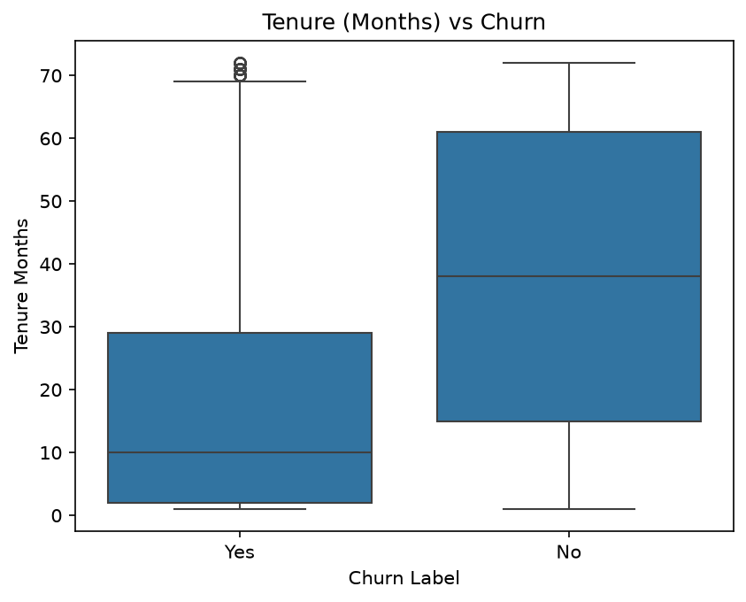
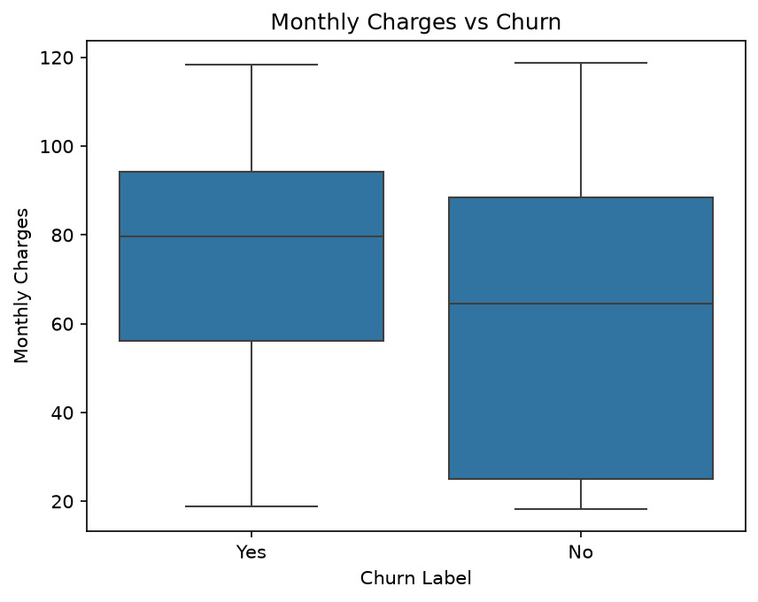
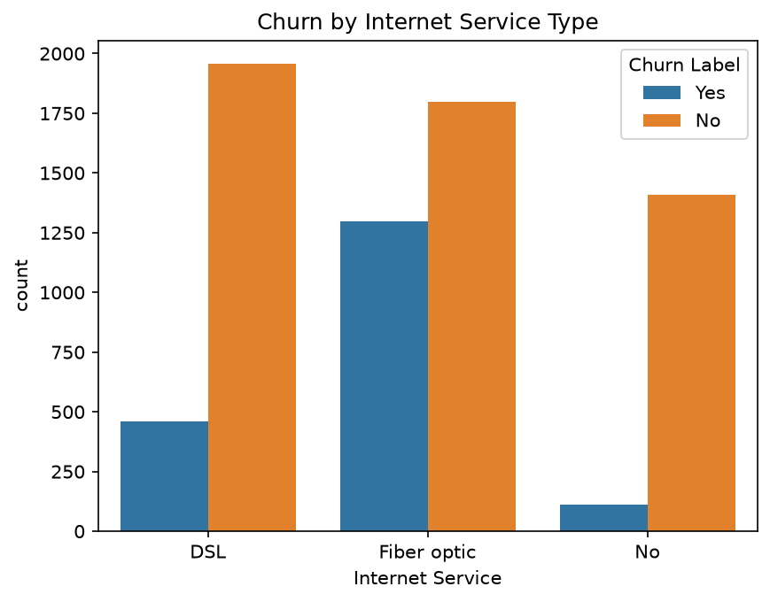
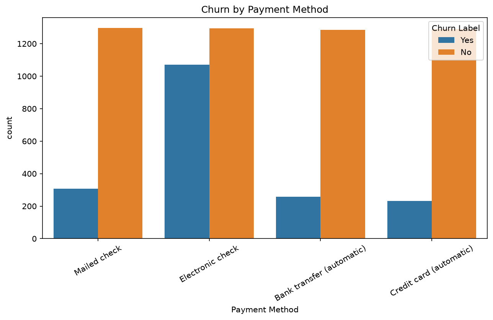
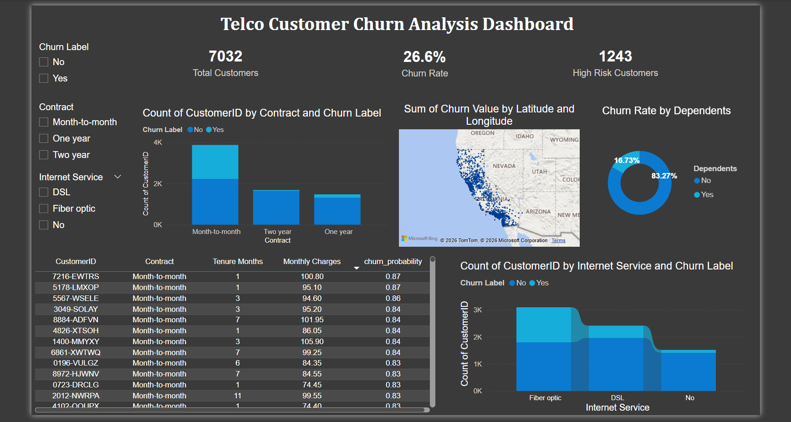

# 📊 Telco Customer Churn Analysis

## 🔍 Project Overview
This project analyzes customer churn for a telecom company using 
real-world data of 7,032 customers. The goal is to identify which 
customers are likely to cancel their subscription, understand the 
key reasons behind churn, and provide actionable business 
recommendations to improve customer retention.

## 🛠️ Tools & Technologies Used
- **Python** (Pandas, Matplotlib, Seaborn, Scikit-learn)
- **Power BI** (Interactive Dashboard)
- **Jupyter Notebook via VS Code** (Analysis & Modeling)
- **GitHub** (Version control)

## 📁 Project Structure
customer-churn-analysis/
│
├── data/
│   ├── Telco_customer_churn.xlsx        
│   └── telco_churn_with_predictions.csv 
│
├── charts/
│   ├── churn_by_contract.png
│   ├── tenure_vs_churn.png
│   ├── monthly_charges_vs_churn.png
│   ├── churn_by_internet_service.png
│   └── feature_importance.png
│
├── churn_analysis.ipynb   
├── telco_churn_dashboard.pbix
├── dashboard.png
└── README.md              

## 📊 Dataset
- **Source:** IBM Telco Customer Churn Dataset (Kaggle)
- **Size:** 7,032 customers, 33 columns
- **Key columns:** Contract type, Tenure Months, Monthly Charges, 
Internet Service, Payment Method, Churn Label

## 🔎 Key Findings
1. **Overall churn rate is 26.6%** — more than 1 in 4 customers 
   are leaving
2. **Contract type is the strongest churn driver** — month-to-month 
   customers churn at a much higher rate than 1-year or 2-year 
   contract customers
3. **Fiber optic customers churn more** despite paying higher 
   monthly charges — possible service quality or pricing issue
4. **Electronic check payment method** correlates with higher churn 
   — these customers may be less committed than those on 
   automatic payments
5. **Low tenure = high risk** — customers in their first 1-3 months 
   are most likely to leave
6. **Customers with dependents churn 3x less** than those without — 
   family customers are significantly more loyal

## 🤖 Machine Learning Model
- **Algorithm:** Logistic Regression
- **Accuracy:** 81.2%
- **Training/Test split:** 80% / 20%
- **Key result:** Model successfully identifies high-risk customers 
  with 70% precision

## 💡 Business Recommendation
Out of 7,032 customers, **1,243 high-risk, high-value customers** 
were identified — customers likely to churn who pay above-average 
monthly bills, representing approximately **$108,456 in monthly 
revenue at risk.**

Recommended retention strategies:
1. Offer contract upgrade incentives to month-to-month customers 
   — 2-year contracts are the single strongest loyalty driver
2. Bundle Online Security and Tech Support for at-risk customers 
   — these add-ons significantly reduce churn probability
3. Investigate Fiber optic service quality — these customers churn 
   at unexpectedly high rates despite being high-paying
4. Target electronic check users with auto-payment incentives 
   to increase their commitment level

## 📊 Python Visualizations

### Churn by Contract Type

*Month-to-month customers churn at significantly higher rates 
than 1-year or 2-year contract customers*

### Tenure vs Churn

*Customers who churned tend to have much lower tenure — 
newer customers are at highest risk*

### Monthly Charges vs Churn

*Churned customers pay higher monthly charges on average*

### Churn by Internet Service

*Fiber optic customers churn at notably higher rates than 
DSL or no-internet customers*

### Feature Importance (Key Churn Drivers)

*Top factors that increase and decrease churn risk 
according to the logistic regression model*

## 📈 Power BI Dashboard

The interactive dashboard includes:
- KPI cards (Total Customers, Churn Rate, High-Risk Customers)
- Churn by Contract Type (bar chart)
- Churn by Internet Service (bar chart)
- Geographic churn map (by city/state)
- Churn Rate by Dependents (donut chart)
- High-risk customer priority table
- Interactive slicers (Contract, Internet Service, Churn Label)

## 🚀 How to Run This Project
1. Clone this repository
2. Install required libraries:
   pip install pandas matplotlib seaborn scikit-learn openpyxl
3. Open churn_analysis.ipynb in VS Code
4. Run all cells in order from top to bottom
5. Open telco_churn_dashboard.pbix in Power BI Desktop

## 👩‍💻 Author
Vediti Kapale
- 📧 veditikapale06@gmail.com
- 🔗 GitHub: https://github.com/vediti06-glitch